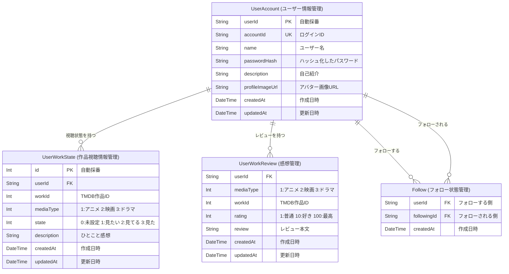

# ER図

```mermaid
erDiagram
    UserAccount["UserAccount (ユーザー情報管理)"] {
        String userId PK "自動採番"
        String accountId UK "ログインID"
        String name "ユーザー名"
        String passwordHash "ハッシュ化したパスワード"
        String description "自己紹介"
        String profileImageUrl "アバター画像URL"
        DateTime createdAt "作成日時"
        DateTime updatedAt "更新日時"
    }

    UserWorkState["UserWorkState (作品視聴情報管理)"] {
        Int id PK "自動採番"
        String userId FK
        Int workId "TMDB作品ID"
        Int mediaType "1:アニメ 2:映画 3:ドラマ"
        Int state "0:未設定 1:見たい 2:見てる 3:見た"
        String description "ひとこと感想"
        DateTime createdAt "作成日時"
        DateTime updatedAt "更新日時"
    }

    UserWorkReview["UserWorkReview (感想管理)"] {
        String userId FK
        Int mediaType "1:アニメ 2:映画 3:ドラマ"
        Int workId "TMDB作品ID"
        Int rating "1:普通 10:好き 100:最高"
        String review "レビュー本文"
        DateTime createdAt "作成日時"
        DateTime updatedAt "更新日時"
    }

    Follow["Follow (フォロー状態管理)"] {
        String userId FK "フォローする側"
        String followingId FK "フォローされる側"
        DateTime createdAt "作成日時"
    }

    UserAccount ||--o{ UserWorkState : "視聴状態を持つ"
    UserAccount ||--o{ UserWorkReview : "レビューを持つ"
    UserAccount ||--o{ Follow : "フォローする"
    UserAccount ||--o{ Follow : "フォローされる"
```
