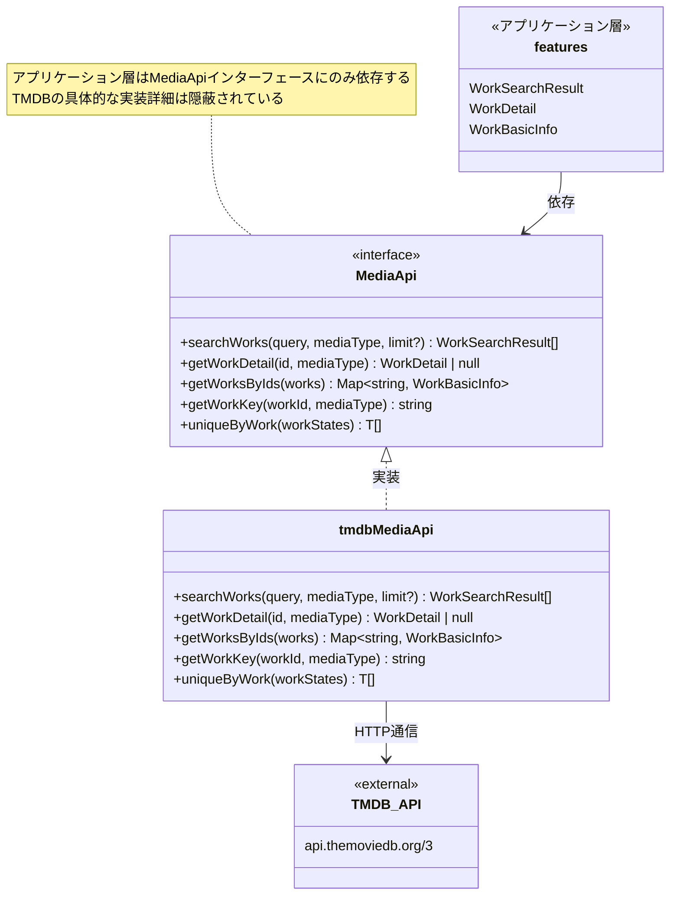
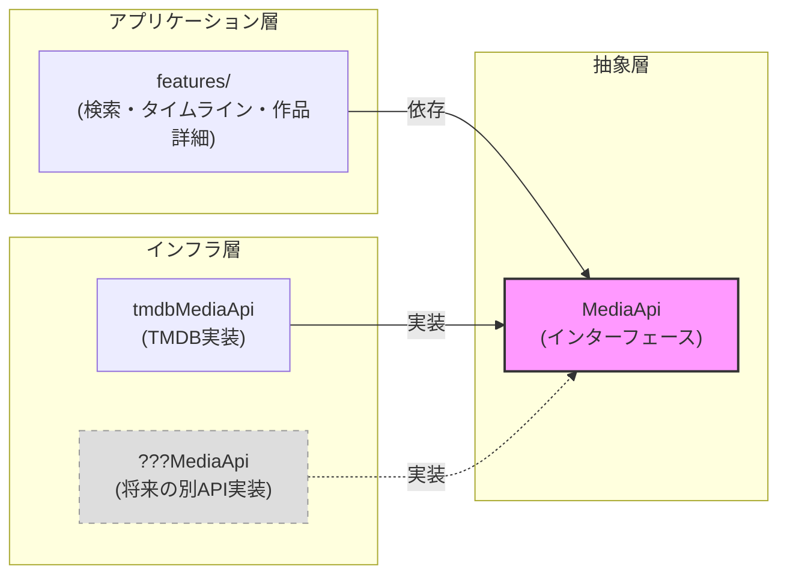

# MediaAPI クラス図 (依存性逆転の原則)

## 設計意図: 依存性逆転の原則 (DIP)

- アプリケーション層は `MediaApi` インターフェースにのみ依存
- TMDB固有の型やAPIの詳細は `tmdbMediaApi` 内に閉じ込められている
- 将来TMDBから別のAPIに切り替える場合、`MediaApi`を実装した新しいオブジェクトを差し替えるだけで対応可能
